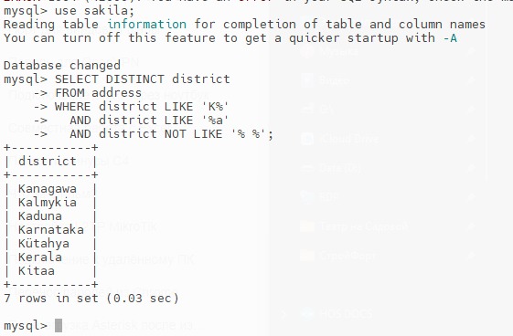
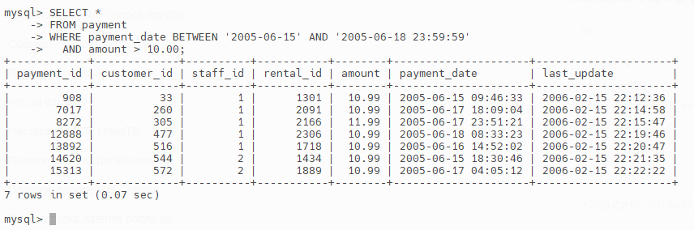
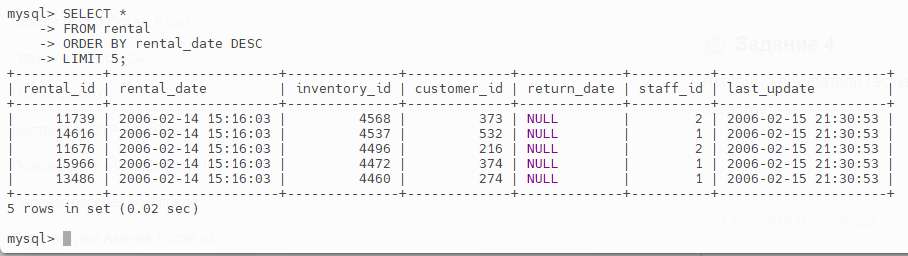
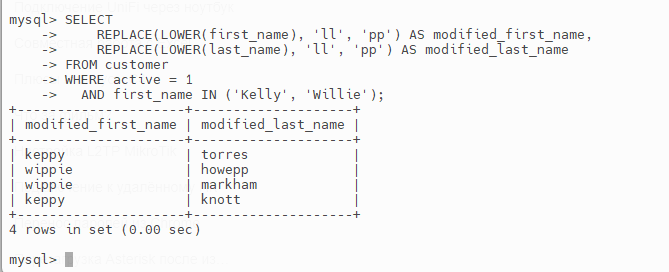

# Домашнее задание к занятию "SQL. Часть 1"

### Задание 1
#### Уникальные районы (district), начинающиеся на 'K', заканчивающиеся на 'a' и без пробелов
```
SELECT DISTINCT district
FROM address
WHERE district LIKE 'K%' 
  AND district LIKE '%a'
  AND district NOT LIKE '% %';
  ```
Уникальные районы 

### Задание 2
#### Платежи между 15 и 18 июня 2005 года, сумма больше 10
```
SELECT *
FROM payment
WHERE payment_date BETWEEN '2005-06-15' AND '2005-06-18 23:59:59'
  AND amount > 10.00;
  ```
Платежи 

### Задание 3
#### Последние 5 аренд фильмов (таблица rental)
```
SELECT *
FROM rental
ORDER BY rental_date DESC
LIMIT 5;
```
Последние 5 аренд 

### Задание 4
#### Активные покупатели (active = 1), имена Kelly или Willie, замена 'll' на 'pp', приведение к нижнему регистру
```
SELECT
    REPLACE(LOWER(first_name), 'll', 'pp') AS modified_first_name,
    REPLACE(LOWER(last_name), 'll', 'pp') AS modified_last_name
FROM customer
WHERE active = 1
  AND first_name IN ('Kelly', 'Willie');
  ```
Активные покупатели 
